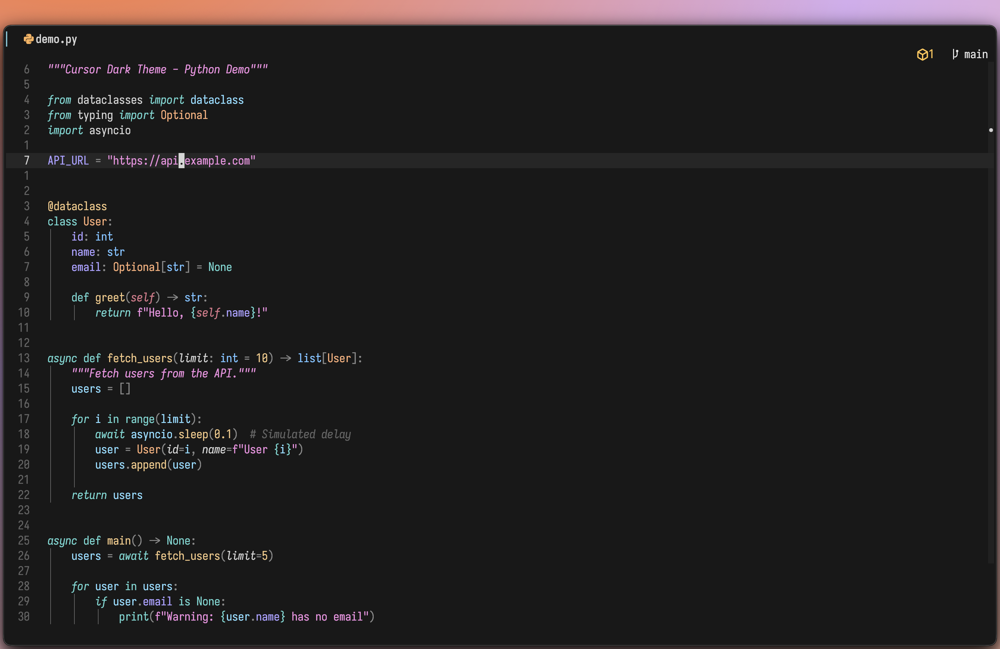

# cursor-dark.nvim

A Neovim colorscheme port of Cursor's **"Cursor Dark"** theme.



## Requirements

- Neovim 0.9+ (truecolor)

## Install

### lazy.nvim

```lua
{
  "bergholmm/cursor-dark.nvim",
  priority = 1000,
  config = function()
    vim.cmd.colorscheme("cursor-dark")
  end,
}
```

### packer.nvim

```lua
use({
  "bergholmm/cursor-dark.nvim",
  config = function()
    vim.cmd.colorscheme("cursor-dark")
  end,
})
```

## Usage

```vim
colorscheme cursor-dark
```

## License

MIT
